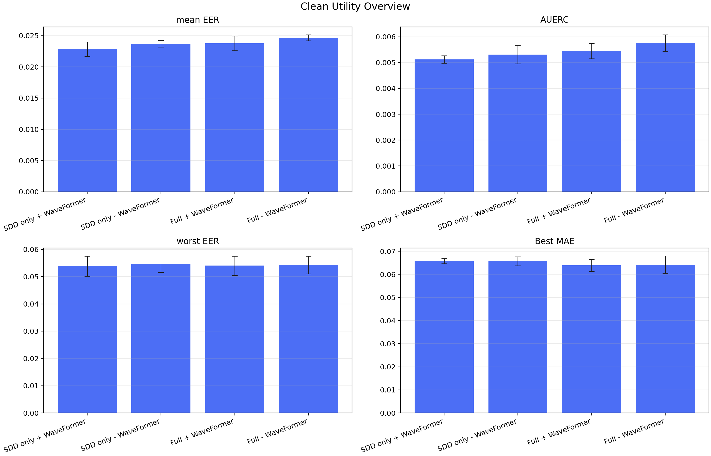
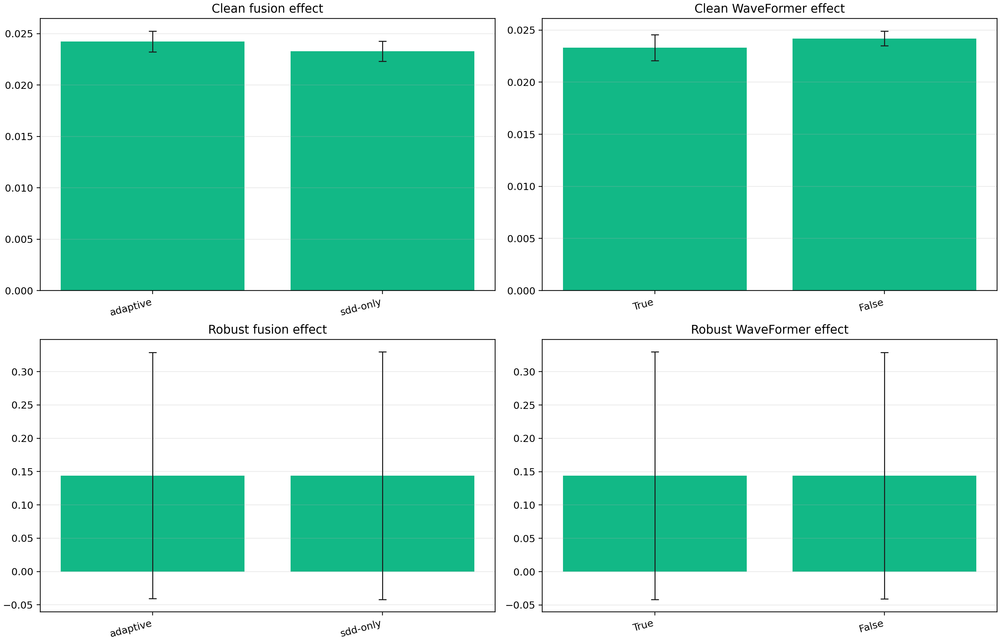
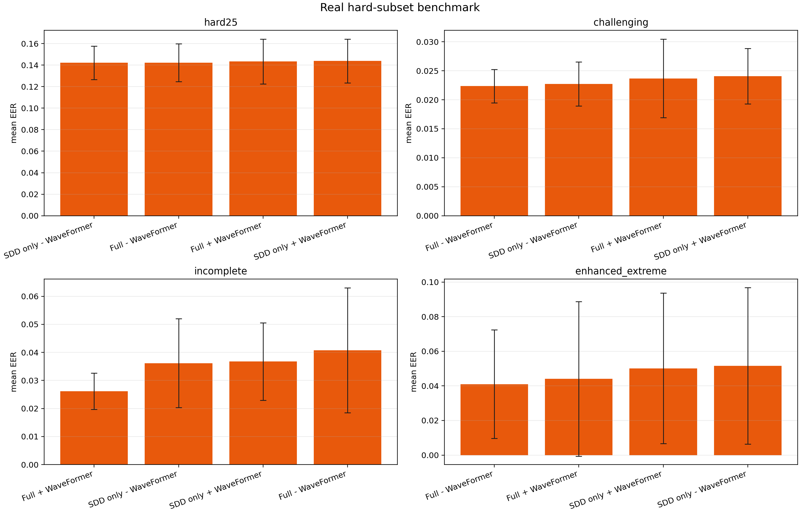
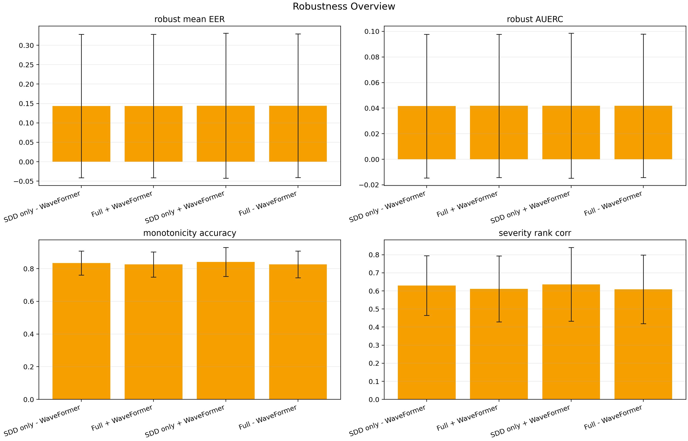

# PV-IQA proof 实验结果总结

本报告基于 `expr/proof/` 下已经生成的 `factorial/`、`subgroups/`、`robustness/` CSV 结果整理，进行总结。

## 1. 实验目的

这一轮 proof 实验主要回答两个问题：

1. **WaveFormer 是否值得保留**
2. **SDD-CR 双分支是否真的有效**

这两个问题的验证方式：

- **WaveFormer**：优先看全局 clean 2×2 因子实验
- **SDD-CR**：优先看真实困难样本子集，而不是只看全体样本平均值

合成 corruption 结果保留，但只作为补充压力测试，不作为主结论来源。

## 2. 实验设置

| 项目 | 配置 |
| --- | --- |
| Recognizer epochs | 12 |
| IQA epochs | 18 |
| Seeds | 2026, 2027, 2028 |
| 对比单元 | Full + WaveFormer / Full - WaveFormer / SDD only + WaveFormer / SDD only - WaveFormer |
| Clean 主指标 | mean EER, AUERC, worst EER, Best MAE |
| 真实困难子集 | challenging, hard25, incomplete, enhanced_extreme |
| 补充压力测试 | brightness / contrast / gaussian-noise / gaussian-blur |

## 3. 全局 clean 结果：WaveFormer 的主要证据

| 实验组 | mean EER | AUERC | worst EER | Best MAE |
| --- | --- | --- | --- | --- |
| SDD only + WaveFormer | 0.0229 ± 0.0011 | 0.0051 ± 0.0001 | 0.0539 ± 0.0037 | 0.0657 ± 0.0011 |
| SDD only - WaveFormer | 0.0237 ± 0.0005 | 0.0053 ± 0.0004 | 0.0546 ± 0.0030 | 0.0657 ± 0.0019 |
| Full + WaveFormer | 0.0238 ± 0.0012 | 0.0054 ± 0.0003 | 0.0541 ± 0.0035 | 0.0639 ± 0.0026 |
| Full - WaveFormer | 0.0247 ± 0.0005 | 0.0058 ± 0.0003 | 0.0543 ± 0.0033 | 0.0643 ± 0.0037 |

### 3.1 直接观察

1. **全局最优单模型**是 `SDD only + WaveFormer`。
2. 在同一融合方式下，**WaveFormer 打开后 mean EER 和 AUERC 都更低**。
3. `Full + WaveFormer` 虽然不是全局第一，但明显优于 `Full - WaveFormer`。

### 3.2 主效应结果

| 因子 | 水平 | mean EER | AUERC | worst EER |
| --- | --- | --- | --- | --- |
| fusion | sdd-only | 0.0233 | 0.0052 | 0.0542 |
| fusion | adaptive | 0.0242 | 0.0056 | 0.0542 |
| waveformer | True | 0.0233 | 0.0053 | 0.0540 |
| waveformer | False | 0.0242 | 0.0055 | 0.0544 |

### 3.3 结论

- **WaveFormer 的 clean 主效应为正**：`waveformer=True` 比 `False` 的 `mean EER` 低约 `0.0009`。
- 因此，**WaveFormer 应保留**。
- 同时也要承认：**当前 adaptive 融合在全体样本平均上仍弱于 sdd-only**。这意味着问题不在 WaveFormer，而更可能在双分支融合/CR 分支利用方式。

## 4. 真实困难样本子集：SDD-CR 的主要证据

本节不再问“全体样本平均谁最好”，而是问：**在更符合 CR 理论作用场景的真实困难样本上，双分支是否提供了额外信息。**

### 4.1 子集定义

| 子集 | 含义 |
| --- | --- |
| challenging | 文件名中显式带真实退化标记的样本总集 |
| hard25 | 按 recognizer 类间 margin 排出的最难 25% 测试样本 |
| incomplete | 真实结构缺失/遮挡样本 |
| enhanced_extreme | 真实极端增强样本 |

### 4.2 每个子集的最优单模型

| 子集 | 最优实验组 | mean EER | AUERC |
| --- | --- | --- | --- |
| challenging | Full - WaveFormer | 0.0223 ± 0.0029 | 0.0060 ± 0.0006 |
| hard25 | SDD only - WaveFormer | 0.1421 ± 0.0155 | 0.0417 ± 0.0041 |
| incomplete | Full + WaveFormer | 0.0261 ± 0.0065 | 0.0064 ± 0.0038 |
| enhanced_extreme | Full - WaveFormer | 0.0410 ± 0.0313 | 0.0108 ± 0.0081 |

### 4.3 双分支 family 与单分支 family 的平均对比

| 子集 | adaptive | sdd-only | 结论 |
| --- | --- | --- | --- |
| challenging | 0.0230 | 0.0234 | adaptive 略优 |
| hard25 | 0.1428 | 0.1430 | 几乎持平，adaptive 略优 |
| incomplete | 0.0334 | 0.0365 | adaptive 明显更优 |
| enhanced_extreme | 0.0426 | 0.0509 | adaptive 明显更优 |

### 4.4 解读

这部分结果比“全体样本平均”更接近我们要验证的理论：

1. **`incomplete` 子集上，双分支有明确优势。**
   `adaptive` 相比 `sdd-only` 的 `mean EER` 降低约 `0.0030`，而且最佳单模型是 **Full + WaveFormer**。这说明在真实结构缺失/遮挡样本上，CR 分支确实提供了有用补充。

2. **`enhanced_extreme` 子集上，双分支优势更明显。**
   `adaptive` 相比 `sdd-only` 的 `mean EER` 降低约 `0.0083`。这表明在更激进、更偏离常规分布的样本上，双分支比单纯 SDD 更稳。

3. **`challenging` 总体上，双分支也略优。**
   优势不大，但方向一致：`0.0230` vs `0.0234`。

4. **`hard25` 子集上，双分支 family 只有极小优势。**
   `adaptive` 的 family 平均略优，但最佳单模型仍是 `SDD only - WaveFormer`。这说明：
   - CR 分支的收益已经出现；
   - 但收益还不够稳定，尚未在所有配置上都转化为明显优势。

## 5. 合成 corruption：只作为补充压力测试

| 实验组 | robust mean EER | robust AUERC | monotonicity | rank corr |
| --- | --- | --- | --- | --- |
| SDD only - WaveFormer | 0.1434 ± 0.1848 | 0.0415 ± 0.0561 | 0.8344 ± 0.0740 | 0.6292 ± 0.1650 |
| Full + WaveFormer | 0.1437 ± 0.1847 | 0.0417 ± 0.0560 | 0.8257 ± 0.0766 | 0.6111 ± 0.1825 |
| SDD only + WaveFormer | 0.1442 ± 0.1866 | 0.0418 ± 0.0567 | 0.8404 ± 0.0885 | 0.6361 ± 0.2035 |
| Full - WaveFormer | 0.1442 ± 0.1848 | 0.0418 ± 0.0560 | 0.8258 ± 0.0820 | 0.6084 ± 0.1897 |

### 5.1 如何理解这一节

- 合成 corruption 下四个 cell 的差异**非常小**。
- 最优项是 `SDD only - WaveFormer`，但优势量级远小于真实困难子集实验里观察到的结构性差异。
- 因此这一节更适合作为“极端分布外扰动压力测试”，**不适合作为推翻 clean 主结论或真实子集结论的主要证据**。

## 6. 综合结论

### 6.1 关于 WaveFormer

结论是明确的：**保留 WaveFormer。**

依据不是某个局部子集，而是全局 clean 2×2 因子实验：

- `waveformer=True` 的主效应优于 `False`
- `Full + WaveFormer` 优于 `Full - WaveFormer`
- 全局最优单模型也是 `SDD only + WaveFormer`

因此，当前结果**不支持移除 WaveFormer**。

### 6.2 关于 SDD-CR 双分支

结论需要更精确表述：

- **不能说“SDD-CR 在全体样本平均上已经全面胜过 SDD only”**
  因为 clean 全局平均上，`adaptive` 仍弱于 `sdd-only`。

- **但可以说“SDD-CR 在真实结构困难样本上已经证明有效”**
  因为在 `incomplete`、`enhanced_extreme`，以及更宽松的 `challenging` 子集上，`adaptive` family 都优于 `sdd-only`。

所以当前最准确的结论是：

> **CR 分支已经证明具备针对结构困难样本的补充价值；当前的主要瓶颈不是“CR 完全无效”，而是“现有 adaptive 融合还没有把这部分局部优势稳定转化为全体样本的平均优势”。**

### 6.3 对后续实验设计的启示

下一步如果继续做算法优化，重点不该是删除 WaveFormer，而应放在：

1. **改进双分支融合策略**
2. **提升 CR 分支在常规样本上的可用性**
3. **让局部困难样本上的收益更稳定地传导到全局平均指标**

换句话说，当前结果更支持这样的研究叙述：

> **WaveFormer 提升了整体质量评估能力；SDD-CR 双分支提升了模型对真实结构困难样本的判别能力，但融合策略仍需进一步优化。**
